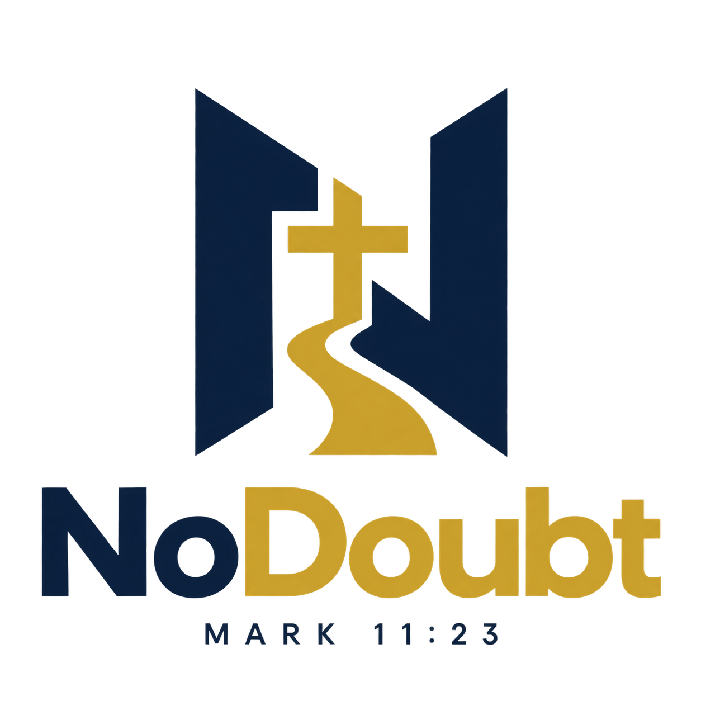

# No Doubt



A cross-platform Christian apologetics and doubt-support application planned for the web, iOS, and Android.

## Development

Requires Node.js 22 or newer.

```bash
npm install
npm start
```

Open `http://localhost:4200`. Use `npm run build`, `npm run lint`, and `npm test -- --watch=false` before submitting changes.

The first vertical slice includes a responsive home/search experience and a structured sample answer for “Is God even real?”. Content in this early build is demonstrative and must pass the editorial workflow before release.

## Planning

- [Product and build plan](docs/PRODUCT_PLAN.md)
